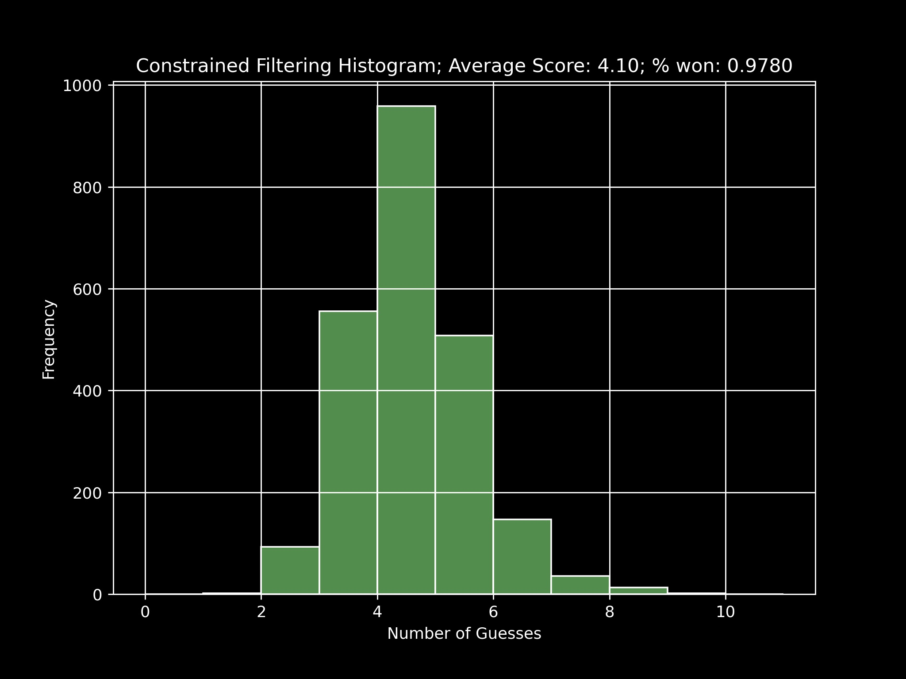

<h1 align="center">IS 597 - Data Structures and Algorithms: Final Project - Wordle </h1>

## Background

Wordle is a web-based word game created and developed by Welsh software engineer Josh Wardle, and owned and published by The New York Times Company since 2022. Players have six attempts to guess a five-letter word, with feedback given for each guess in the form of colored tiles indicating when letters match or occupy the correct position. (description sourced from Wikipedia)

## Rising Popularity

Wordle has gained much popularity since the start of 2022. According to an <a href="https://theconversation.com/codecracking-community-and-competition-why-the-word-puzzle-wordle-has-become-a-new-online-obsession-174878"> article </a> by The Conversation. Wordle has nearly 3 million players across the world and versions of it are appearing in other languages. 

## Solving Wordle: Human Performance

With the growing popularity, the conversation of solving Wordle is a highly by individuals from various circles. A topic of much debate within the community is the choice of starting word. 

Below is a visualisation map depicting the average attempts it takes for a player to solve Wordle by country:

Below is a visualisation depicting the average attempts it takes for a player to solve Wordle on a city level:

Image Sources: <a href="https://word.tips/wordle-wizards/"> Word Tips </a>

## Solving Wordle: An Algorithmic Approach

For our final project we attempt to build an algorithm to solve Wordle.

### Iteration 0: The Naive Approach

For our first iteration, we attempted solve Wordle in the most naive possible way - Random Guessing. The approach is simple enough and easy to implement, but unsurprisingly performs poorly in practise. We performed simulations of all 2316 games (the size of the Wordle dictionary), and the solver was able to win very few games.

### Iteration 1: Constrained Filtering with Random Guessing

An improvement to build on our previous iteration involved solving the game more tactfully. This approach involved using the feedback (the letter colours) to reduce the search space for the next guess, thereby reducing the search space after every step and making guesses with slightly more finesse. While we reduced the search space with signficant effect, there was still an element of "randomness" with regards to choosing a word from the pool for the next guess.

Below we see a histogram depicting the performance of a simulation of this approach for all games:

We see that a simple change results in a solver capable of winning ~97.8% of the games! Can we do better than randomly selecting a word from a filtered pool?

### Iteration 2: Constrained Filtering with Information Theory

The biggest hinderance with the previous iteration's solver comes from making guesses "randomly" from the pool of choices. In order to improve on this we need to quantify the value of each word. In order to do so, we leverage <a href ="https://en.wikipedia.org/wiki/Information_theory"> Information Theory </a>. This is a well studied field that comes at the intersection of probability, statistics, computer science among other fields. The central theme of Information Theory is to capture "entropy" which can be thought of as a measure of uncertainty associated with a Random Variable. Our goal is to perform something similar where we aim to reduce the uncertainty within our pool of possible words, which are each equally likely, down to the one correct word to win the game.

We will be making using of a modified version of the Expectation Equation, as seen below to capture this uncertainty metric.

In essence, we hope to create a metric that helps us capture how much uncertainty would entering in a particular word reduce, on average, to help us reduce our search space. Higher the number better. 

