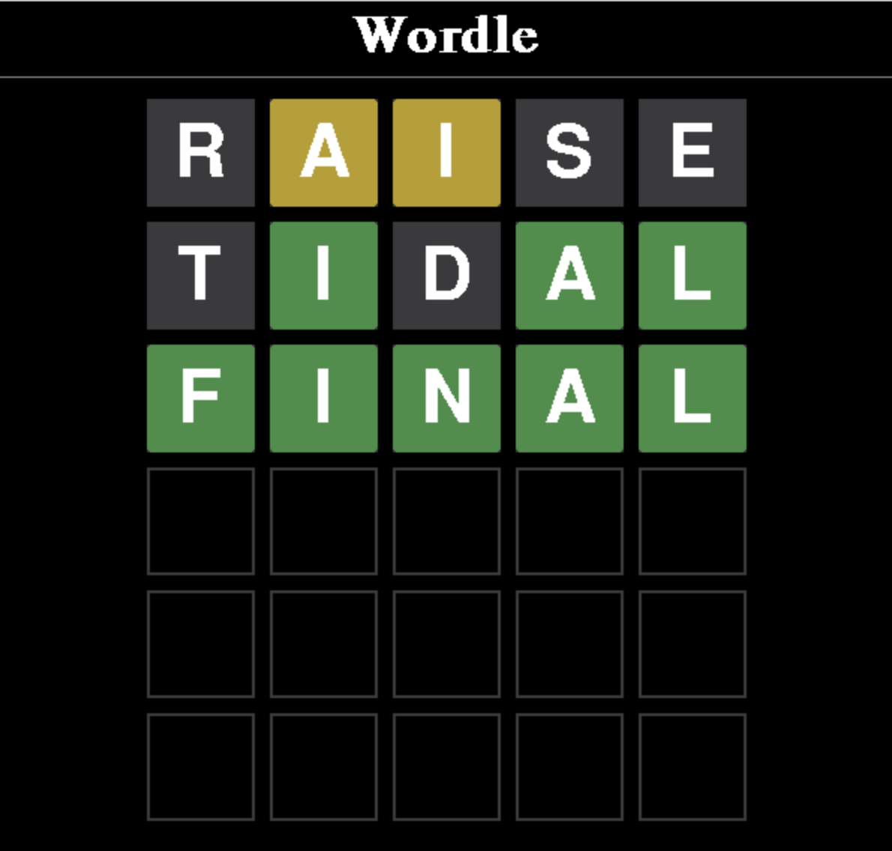

<h1 align="center">IS 597 - Data Structures and Algorithms: Final Project - Wordle </h1>

## Background

Wordle is a web-based word game created and developed by Welsh software engineer Josh Wardle, and owned and published by The New York Times Company since 2022. Players have six attempts to guess a five-letter word, with feedback given for each guess in the form of colored tiles indicating when letters match or occupy the correct position. (description sourced from Wikipedia)

## Rising Popularity

Wordle has gained much popularity since the start of 2022. According to an <a href="https://theconversation.com/codecracking-community-and-competition-why-the-word-puzzle-wordle-has-become-a-new-online-obsession-174878"> article </a> by The Conversation. Wordle has nearly 3 million players across the world and versions of it are appearing in other languages. 

## Solving Wordle

With the growing popularity, the conversation of solving Wordle is a highly by individuals from various circles. A topic of much debate within the community is the choice of starting word. Below is a map depicting the average attempts it takes for a player to solve Wordle by country.

